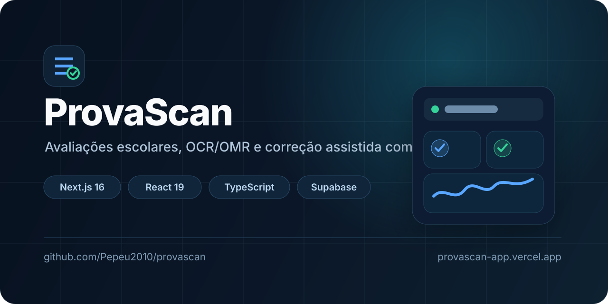
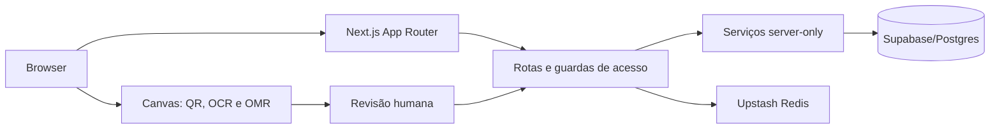

<p align="center">
  
</p>

<p align="center">
  <a href="https://provascan-app.vercel.app"></a>
  <a href="https://github.com/Pepeu2010/provascan/actions/workflows/ci.yml"></a>
</p>

# ProvaScan

Plataforma para organizar avaliações escolares, emitir cartões-resposta e conferir marcações por foto com revisão humana. Desenvolvida para uso operacional por equipes pedagógicas, com controle de acesso por função.

[Abrir aplicação](https://provascan-app.vercel.app) · [Repositório](https://github.com/Pepeu2010/provascan) · [Segurança](./SECURITY.md) · [Contribuição](./CONTRIBUTING.md)

## Visão geral

O ProvaScan centraliza turmas, alunos, provas, gabaritos e correções. A equipe gestora acompanha a operação da escola; professores trabalham nas seções de avaliações colaborativas que lhes foram atribuídas. O resultado da leitura é uma sugestão: a pessoa responsável confirma ou ajusta antes de concluir a correção.

## Funcionalidades principais

- Cadastro e manutenção de turmas, alunos, provas, gabaritos e resultados.
- Provas colaborativas por seções, com autoria de professores, revisão e liberação pela gestão.
- Emissão de cartões-resposta e gabaritos em ordem, com seleção de estudantes para impressão.
- Correção assistida por foto ou PDF: leitura de QR, identificação por OCR, detecção de bolhas e indicação de confiança.
- Retificação de foto de celular quando as bordas da folha são detectadas com segurança; em caso de dúvida, a imagem original é preservada.
- Painéis de resultados e acompanhamento de correções.
- Perfis `professor`, `coordenador`, `vice_diretor` e `admin`. `admin` e `vice_diretor` compartilham o escopo de gestão institucional; coordenação possui gestão acadêmica; professores acessam suas provas atribuídas.
- Autenticação com sessão assinada, troca obrigatória de senha quando aplicável e MFA por TOTP.

## Como funciona

```text
Turmas e alunos
      ↓
Criação da prova e do gabarito
      ↓
Impressão dos cartões-resposta
      ↓
Foto ou PDF do cartão
      ↓
QR + OCR/OMR no navegador
      ↓
Conferência humana e salvamento do resultado
```

## Arquitetura



O frontend usa o App Router do Next.js. As páginas protegidas verificam a sessão no servidor e o `proxy` bloqueia áreas privadas antes da navegação. As rotas de API ainda validam permissões específicas, origem da requisição, dados recebidos e limites de uso.

O acesso ao Supabase por chave de serviço fica em módulos marcados como `server-only`; o navegador não recebe essa chave. As migrations em [`supabase/migrations`](./supabase/migrations) definem o esquema, revogações e políticas de acesso direto ao banco.

## OCR e correção por foto

A correção é executada no dispositivo do usuário:

1. O arquivo é transformado em `canvas`; PDFs são renderizados no navegador.
2. O QR do cartão é lido com `jsQR` e validado antes de vincular prova, turma e aluno.
3. A área de identificação passa pelo Tesseract em português e é comparada à lista de alunos.
4. O cartão é analisado por modelo de bolhas (OMR), que diferencia marcação, branco, múltipla marcação e baixa confiança.
5. A interface solicita confirmação manual quando há incerteza.

Para foto de celular, o sistema tenta nivelar a folha por transformação projetiva apenas quando detecta um documento plausível. A qualidade da imagem, iluminação, sombra, corte e impressão ainda afetam o resultado. O OCR não substitui a conferência humana.

As imagens usadas nesse fluxo não são enviadas para armazenamento de arquivos pelo fluxo atual de correção. O endpoint `/api/scan` é protegido e limitado, mas hoje retorna uma análise demonstrativa; a leitura operacional do cartão acontece no cliente.

## Stack

- [Next.js 16](https://nextjs.org/) com React 19 e TypeScript.
- Tailwind CSS para estilos e componentes utilitários do projeto.
- Supabase/Postgres para dados operacionais e limitação persistente de requisições.
- Upstash Redis para limitação distribuída quando configurado.
- `jose`, `bcryptjs` e `otpauth` para sessão, senhas e MFA TOTP.
- `jsQR`, `tesseract.js`, `pdfjs-dist` e Canvas para QR, OCR, PDF e leitura de marcações.
- `qrcode` para QR de autenticação e impressão; Vercel Speed Insights para métricas reais de navegação.

## Segurança

- Sessões JWT assinadas com `HS256`, em cookie `HttpOnly`, `SameSite=Lax` e `Secure` em produção.
- Senha protegida com bcrypt; usuários legados são tratados pelo fluxo de autenticação compatível do sistema.
- MFA TOTP com segredo cifrado por AES-256-GCM, usando uma chave de 32 bytes em Base64.
- Autorização no servidor por perfil e por recurso, com validação adicional nas rotas de API.
- Validação de entrada com Zod, verificação de mesma origem em operações sensíveis e resposta sem cache para APIs.
- Cabeçalhos CSP, `X-Frame-Options: DENY`, `nosniff`, política de referências e política de permissões.
- Limitação de requisições por Redis quando disponível, com persistência no Supabase como alternativa.

Antes de publicar, configure as variáveis do ambiente na Vercel e mantenha `.env.local`, chaves privadas, tokens e credenciais de serviço fora do Git. Consulte também [OCR_SECURITY.md](./OCR_SECURITY.md), [SUPABASE_SECURITY.md](./SUPABASE_SECURITY.md), [RLS_POLICIES.md](./RLS_POLICIES.md) e [VERCEL_SECURITY.md](./VERCEL_SECURITY.md).

## Requisitos e instalação

- Node.js `>= 20.9.0`.
- npm (o repositório inclui `package-lock.json`).
- Um projeto Supabase com as migrations aplicadas.

```powershell
git clone https://github.com/Pepeu2010/provascan.git
Set-Location provascan
npm ci
Copy-Item .env.example .env.local
npm run dev
```

Abra [http://localhost:3000](http://localhost:3000). Para outros shells, crie `.env.local` a partir de `.env.example` pelo comando equivalente.

### Variáveis de ambiente

| Variável | Uso | Necessidade |
| --- | --- | --- |
| `SUPABASE_URL` | URL do projeto Supabase usada no servidor. | Obrigatória |
| `SUPABASE_SERVICE_ROLE_KEY` | Acesso de serviço ao Supabase; nunca exponha ao navegador. | Obrigatória |
| `AUTH_SECRET` | Segredo de sessão com pelo menos 32 caracteres. | Obrigatória |
| `MFA_ENCRYPTION_KEY` | Chave Base64 de exatamente 32 bytes para cifrar segredos TOTP. | Obrigatória para MFA |
| `MFA_REQUIRED` | Define a política de MFA; `true` é o padrão recomendado. | Recomendada |
| `UPSTASH_REDIS_REST_URL` | Endpoint REST do Redis Upstash. | Recomendada em produção |
| `UPSTASH_REDIS_REST_TOKEN` | Token do Redis Upstash. | Recomendada em produção |
| `NEXT_PUBLIC_SUPPORT_PIX_KEY` | Chave PIX exibida na área de apoio. | Opcional |
| `NEXT_PUBLIC_SUPPORT_PIX_NAME` | Nome do recebedor exibido. | Opcional |
| `NEXT_PUBLIC_SUPPORT_PIX_CITY` | Cidade do recebedor exibida. | Opcional |

`AUTH_SESSION_SECRET` é aceito apenas como nome alternativo de compatibilidade; use `AUTH_SECRET` em novas instalações. Não há uma variável para ativar o Tesseract: ele é carregado dinamicamente pelo fluxo de correção no navegador.

### Banco de dados

Revise e aplique as migrations de [`supabase/migrations`](./supabase/migrations) no projeto Supabase antes do primeiro uso. Elas incluem fundação do esquema, políticas de segurança, limites persistentes e tabelas de avaliações colaborativas. O repositório não fornece um comando npm para executar migrations automaticamente.

## Comandos

| Objetivo | Comando |
| --- | --- |
| Desenvolvimento | `npm run dev` |
| Lint | `npm run lint` |
| Tipagem | `npx tsc --noEmit` |
| Build de produção | `npm run build` |
| Servidor de produção | `npm run start` |
| OCR com fixture | `npm run test:ocr-fixture` |
| Foto de celular com fixture | `npm run test:mobile-photo-fixture` |
| Fluxo de autenticação | `npm run test:auth-flow` |
| Acesso colaborativo | `npm run test:collaborative-access` |
| Impressão colaborativa | `npm run test:collaborative-printing` |
| Autorização de API | `npm run test:api-authorization` |
| Estabilidade de carregamento | `npm run test:dashboard-loading-stability` |
| Hardening de segurança | `npm run test:security-hardening` |
| Rascunho de prova colaborativa | `npm run test:collaborative-exam-draft` |
| Migrations em schema novo | `npm run test:fresh-schema-migrations` |
| Fallback WebGL | `npm run test:webgl-fallback` |

Os testes de OCR usam imagens de referência controladas. Eles confirmam o comportamento esperado das fixtures, não uma garantia universal para qualquer fotografia.

## Estrutura do projeto

```text
app/                 Páginas App Router e rotas de API
components/          Interfaces e fluxos interativos
lib/                 Autenticação, autorização, validações e utilitários
services/            Persistência, OCR/OMR e regras de domínio
supabase/migrations/ Evolução do banco e políticas de acesso
scripts/             Verificações de segurança e fixtures
fixtures/            Arquivos de referência para testes de correção
public/              Recursos estáticos
```

## Deploy

A aplicação publicada está em [provascan-app.vercel.app](https://provascan-app.vercel.app). Para um novo deploy na Vercel, conecte o repositório, informe as variáveis de ambiente acima e aplique as migrations no Supabase correspondente. O build é executado com `npm run build`.

## Limitações conhecidas

- A leitura de cartões depende de impressão legível e imagem bem enquadrada; respostas ambíguas exigem revisão.
- O processamento local de OCR pode ser mais lento em aparelhos de menor capacidade.
- A abertura da janela de impressão depende de o navegador permitir pop-ups para o site.
- Não existe um script npm de provisionamento automático do Supabase.

## Roadmap

O repositório não possui itens de roadmap marcados como `TODO` ou `FIXME` no código. Melhorias futuras devem ser registradas como issues ou decisões de produto antes de serem apresentadas aqui como compromisso.

## Contribuição

Consulte [`CONTRIBUTING.md`](./CONTRIBUTING.md) para instalação, padrões de mudança, requisitos de segurança e checklist antes de abrir um pull request.

## Licença

Este repositório não inclui um arquivo de licença. Todos os direitos permanecem reservados até que uma licença explícita seja adicionada.
